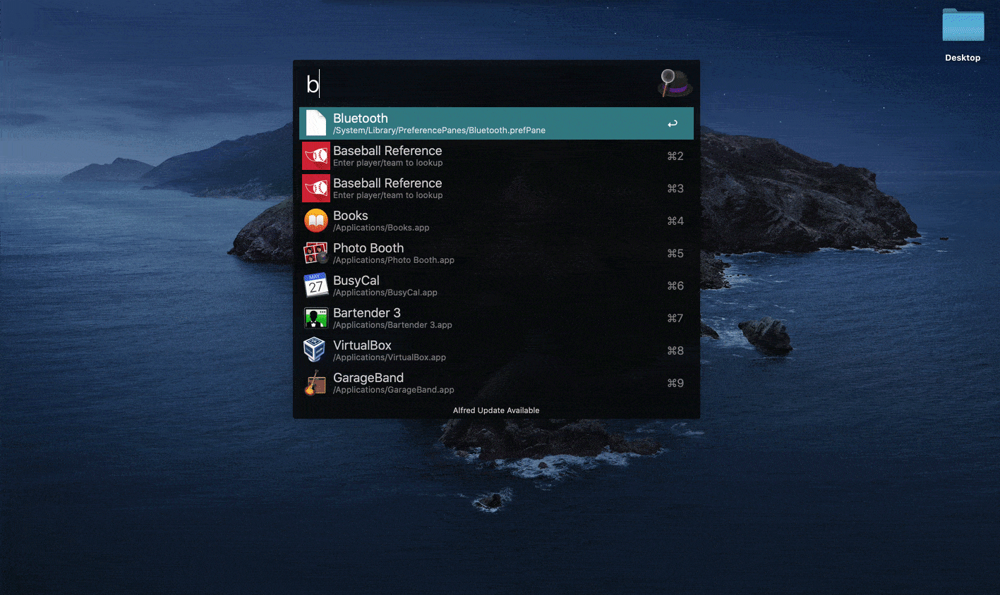

# [Baseball Reference](https://www.baseball-reference.com/) workflow for Alfred

Search for players and teams in Baseball Reference's database.

## Installation
You can download the latest version [here](https://github.com/petems/alfred-bref/releases/latest).

Just open it in Alfred to install this workflow. No further steps are required.

## How to use

1. Open Alfred
1. And write the following for example
1. `bref Max Muncy` or `baseball reference Max Muncy`
